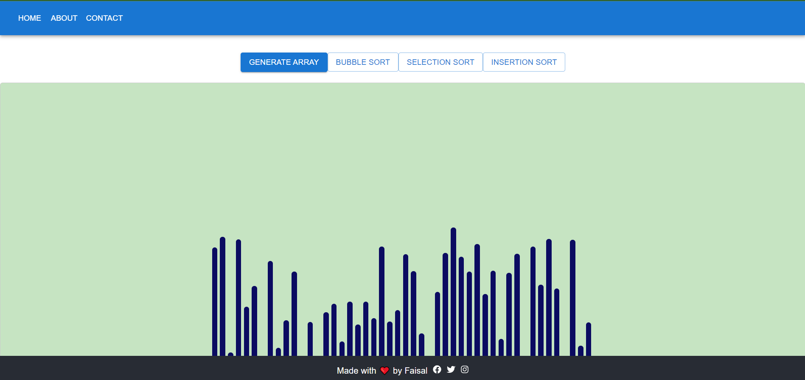

# Sorting-Visualizer

This Sorting Visualizer is built with React Native and utilizes the Material-UI library. It provides a visual representation of sorting algorithms.

## Sorting Algorithms
The following sorting algorithms are implemented and visualized in this project:

- **Bubble Sort:** 
  
- **Selection Sort:** 
  
- **Insertion Sort:** 

## Live Demo
Explore the live Sorting Visualizer web app [here](https://sorting-visualizer-faisal.netlify.app/).



## Usage
1. Clone the repository:

   ```bash
   git clone https://github.com/Faisalkarim/Sorting-Visualizer.git
   cd Sorting-Visualizer
 
